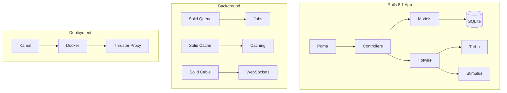
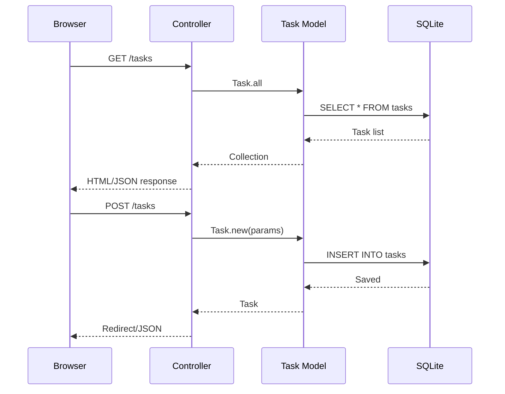
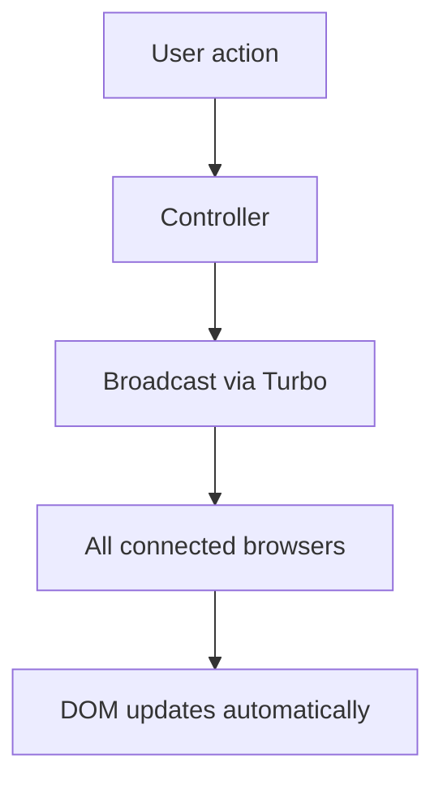

# landonkea-task-manager-web — Design & Workflow

## High-Level Overview

## Task CRUD Flow

## Real-Time Updates

## File Relationships

| File | Purpose | Used By |
|------|---------|---------|
| `app/controllers/tasks_controller.rb` | CRUD handlers | Routes |
| `app/models/task.rb` | Business logic | Controller |
| `app/views/` | HTML templates | Controller |
| `app/javascript/` | Stimulus controllers | Turbo |
| `config/deploy.yml` | Kamal config | Deployment |
| `db/schema.rb` | Database schema | Models |

## draw.io

[Open in draw.io](https://app.diagrams.net/#RTask%20manager%20architecture)
